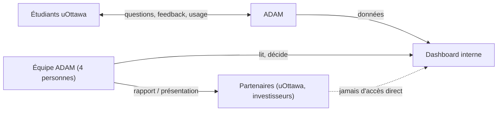
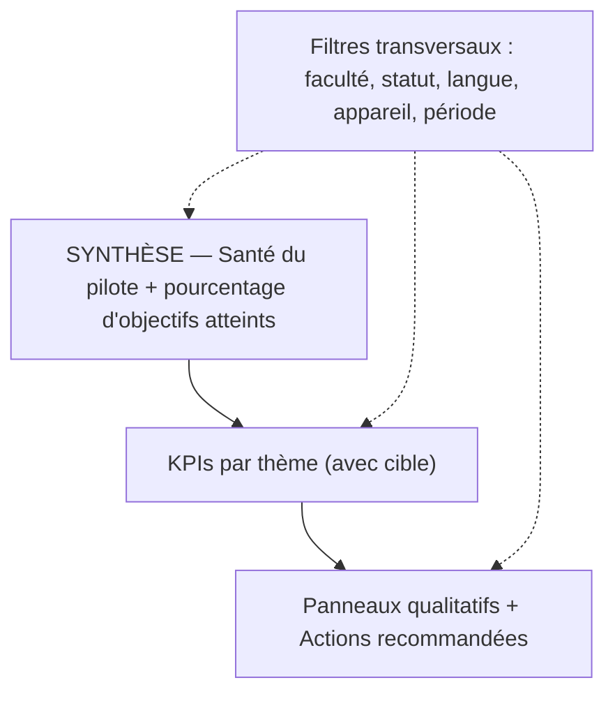
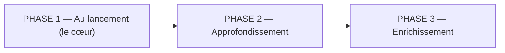

# ADAM — Dashboard interne · Playbook

Created: July 1, 2026 6:34 PM

## 1. C’est quoi ce dashboard

Outil interne de pilotage du pilote ADAM (automne 2026).
Il mesure comment les étudiants d’uOttawa utilisent ADAM et si ça marche.
Utilisé uniquement par l’équipe ADAM (4 personnes), chaque jour / semaine / mois.
Jamais montré à l’extérieur : un membre de l’équipe en extrait les chiffres pour les rapports partenaires.
Principe : synthèse d’abord, détail ensuite. On sait en 2 secondes si ADAM va bien.

---

## 2. Sécurité — ce qu’on fait, ce qu’on ne fait pas

| Mesure | Pourquoi | Comment |
| --- | --- | --- |
| Sous-domaine séparé admin.adamapp.ca | Isoler l’outil interne de l’app étudiante | Héberger le dashboard sur son propre sous-domaine |
| 2FA obligatoire | 4 accès = 4 portes vers des données sensibles | Authentification + second facteur pour chaque membre |
| Session limitée dans le temps | Empêcher un accès oublié ouvert | Déconnexion automatique après inactivité |
| Pas de rôles pour le pilote | 4 personnes de confiance, zéro complexité inutile | Accès total identique pour tous |

---

## 3. La lecture — synthèse d’abord

Pas de score composite opaque. On affiche des KPIs transparents (chacun avec sa cible), surmontés d’un indicateur de synthèse qui domine la Vue d’ensemble.

| Indicateur de synthèse | Définition |
| --- | --- |
| ★ Santé du pilote | Lecture globale de l’état du pilote, seule en haut de l’écran |
| % Objectifs atteints | Combien de KPIs sont sur leur cible, sur le total |

> Règle d’or : l’indicateur de synthèse domine visuellement, seul en haut. Tout le reste est en retrait. Si un chiffre n’aide pas à décider en un coup d’œil, il vit dans sa section, pas sur l’aperçu.
> 

---

## 4. Les métriques

### Utilisateurs / Adoption

| Métrique | Définition | Cible / alarme |
| --- | --- | --- |
| Total comptes | Nombre total de comptes créés | — |
| Nouveaux comptes (jour/sem) | Comptes créés par jour et par semaine | — |
| Statut des utilisateurs | Actifs / inactifs / en attente (invités non connectés) | — |
| Conversion anonyme vers compte | Part des anonymes qui créent un compte après leur 1re question | — |
| DAU / WAU / MAU | Utilisateurs actifs uniques sur 1 / 7 / 30 jours | — |
| Stickiness (DAU/MAU) | Habitude : actifs mensuels présents un jour donné | cible 0,20+ · alarme sous 0,10 |
| Répartitions | Par faculté, statut étudiant, langue, année | — |

### Engagement

| Métrique | Définition | Cible / alarme |
| --- | --- | --- |
| Questions / jour | Volume total de questions par jour | — |
| Questions / utilisateur (médiane) | Profondeur d’usage par étudiant | — |
| Sessions / utilisateur / sem. | Fréquence de retour dans la semaine | — |
| Longueur moyenne de conversation | Nombre de messages par conversation | — |
| Clic sur suggestions | Part des réponses où l’étudiant clique un Next Step | cible 20 %+ · alarme sous 8 % |
| Fonctionnalités les plus utilisées | Poser une question, Recherche du bon service, Calculateur de droits de scolarité, Calendrier (à venir) | — |

### Qualité IA

| Métrique | Définition | Cible / alarme |
| --- | --- | --- |
| Satisfaction (thumbs) | Part de réponses notées positivement | cible 75 %+ · alarme sous 60 % |
| Résolution au 1er échange | Part des questions résolues sans relance ni redirection | cible 65 %+ |
| Répartition des réponses | Mix directe / reformulation / redirection (Stratégies A, B, D) | zone saine 10–25 % |
| Types de conversation | Factuelle / procédure / orientation / hors sujet | — |

### Rétention

| Métrique | Définition | Cible / alarme |
| --- | --- | --- |
| Rétention J+7 (signal n°1) | Part des nouveaux qui reviennent après 7 jours | cible 30 %+ · alarme sous 15 % |
| Rétention J+30 | Part des nouveaux qui reviennent après 30 jours | — |
| Cohortes hebdomadaires | Suivi de chaque cohorte + repères du calendrier académique | — |
| NPS étudiant | Enquête à 2 moments (mi + fin). En attente tant qu’il n’y a pas de résultat. | mi 30+ · fin 50+ |

### Panneaux qualitatifs

| Panneau | Fréquence | Sert à |
| --- | --- | --- |
| Top sujets de questions | Hebdo | Comprendre la demande |
| Où ADAM échoue / manque d’info | Hebdo | Prioriser les améliorations |
| Thèmes de préoccupation | Mensuel | Nourrir le rapport partenaires |

### Couche décision

| Élément | Rôle |
| --- | --- |
| Actions recommandées | Reliées aux métriques hors cible ; disent quoi faire, pas juste quoi regarder |

### Indicateurs d’appoint (un simple chiffre)

Complétion du profil, usage du calculateur, installation PWA.

### Transversal

Filtres globaux : faculté, statut, langue, appareil, période. Le calendrier académique se superpose aux courbes (abandon, inscription, examens) pour expliquer les pics.

---

## 5. La structure du dashboard (sidebar)

| Section | Répond à | Contient |
| --- | --- | --- |
| Vue d’ensemble | ADAM va-t-il bien ? | Santé du pilote, % objectifs, KPIs critiques, actions recommandées |
| Utilisateurs | Qui utilise ADAM ? | Total, statut, nouveaux, répartitions (faculté/statut/langue/année) |
| Facultés | Qui adopte, où ? | Adoption et performance par faculté |
| Activité | Quand et combien ? | DAU/WAU/MAU, volume de questions, pics du calendrier |
| Qualité IA | ADAM répond-il bien ? | Satisfaction, résolution, répartition des réponses, types de conversation, où ADAM échoue |
| Engagement | Ils accrochent ? | Questions/util, sessions, longueur de conv, clic suggestions, fonctionnalités |
| Performance | Atteint-on les objectifs ? | % objectifs atteints, KPIs vs cibles, actions recommandées |
| Rapports | Que transmettre aux partenaires ? | Export des chiffres clés (jamais partagé tel quel) |
| Paramètres | — | Période, source des données, fréquence, responsable |

---

## 6. Visualisation par métrique

La logique : un statut donne un grand chiffre + jauge ; une évolution donne une courbe ; une proportion donne un anneau ou des barres ; la rétention donne une grille de cohortes ; le qualitatif donne des listes. Chaque métrique reçoit la forme qui demande le moins d’effort d’interprétation.

| Métrique | Visualisation |
| --- | --- |
| ★ Santé du pilote, % objectifs | Grand chiffre + jauge, seul en haut |
| Nouveaux comptes | Barres (par jour) + courbe cumulée |
| DAU / WAU / MAU | Courbe (lignes) |
| Statut des utilisateurs | Anneau / barres empilées |
| Conversion anonyme vers compte | Entonnoir + grand pourcentage |
| Stickiness | Chiffre + jauge vs cible |
| Questions / jour | Courbe ou barres |
| Questions / util. et longueur de conv. | Chiffre + histogramme |
| Clic suggestions, satisfaction, résolution | Grand pourcentage + jauge + courbe |
| Répartition des réponses, types de conversation | Anneau / barre empilée |
| Rétention J+7 et J+30 | Grand pourcentage + jauge + courbe |
| Cohortes hebdo | Grille de cohortes (heatmap) + repères calendrier |
| NPS | État « enquête, en attente » puis score + jauge |
| Répartitions (faculté, langue, statut) | Barres horizontales / donut |
| Fonctionnalités utilisées | Barres horizontales (calendrier grisé, à venir) |
| Top sujets, Où ADAM échoue, Thèmes | Listes classées |
| Appoint (profil, calculateur, PWA) | Grand chiffre + mini-jauge |

---

## 7. Rythmes et règles de lecture

Comment l’équipe s’en sert :

- Quotidien — 2 min, Vue d’ensemble seulement : repérer un problème.
- Hebdomadaire — 20 min, toutes les sections, en équipe : décider produit.
- Mensuel — 30 min, Rapports + segmentation : préparer le rapport partenaires.

Ce qu’on ne fait pas :

- On ne partage jamais une capture du dashboard à l’extérieur.
- On ne décide pas sur moins de 2 semaines de données.
- On n’ajoute pas une métrique sans que toute l’équipe soit alignée.

> Section Rapports : un membre de l’équipe y extrait et met en forme les données. Aucune capture n’en sort telle quelle.
> 

---

## 8. Phases de déploiement

On construit le cœur d’abord, puis on enrichit. Phase 1 = tout ce qui précède. Les autres métriques arrivent ensuite, selon leur importance.

PHASE 1 — Au lancement (le cœur). Ce qui permet de savoir si le pilote marche et de réagir vite : synthèse + toutes les métriques des sections 4 et 5 + panneaux qualitatifs + actions recommandées + filtres + indicateurs d’appoint.

### Phase 2 — Approfondissement (post-lancement)

| Métrique | Pourquoi après |
| --- | --- |
| Rétention J+1 | Signal précoce mais bruité ; complète J+7 |
| Complétion du profil par champ | Le total suffit d’abord ; le détail optimise ensuite |
| Usage du calculateur (détail) | Adoption d’abord ; taux de complétion ensuite |
| Installation PWA par plateforme | Un chiffre global d’abord ; la répartition OS ensuite |
| Usage par appareil (répartition) | D’abord un filtre ; répartition dédiée si besoin |
| Questions / util. (moyenne) | La médiane suffit ; la moyenne ajoute les gros utilisateurs |

### Phase 3 — Enrichissement (plus tard)

| Métrique | Pourquoi plus tard |
| --- | --- |
| Activation du calendrier (Tools) | Fonctionnalité à venir, mesurable quand elle sort |
| Pics du calendrier académique (analyse dédiée) | D’abord en surimpression ; analyse à part si utile |
| Durée de session | Signal ambigu, à valider en revue avant d’investir |
| Nouvelles métriques issues des revues | Ajoutées seulement si l’équipe est alignée |

---

## 9. Glossaire

| Terme | Définition | Exemple |
| --- | --- | --- |
| Santé du pilote | Indicateur de synthèse : l’état global du pilote, seul en haut | lecture verte / orange / rouge en un coup d’œil |
| % Objectifs atteints | Nombre de KPIs sur leur cible, sur le total | 6 sur 9 KPIs dans le vert |
| DAU / WAU / MAU | Utilisateurs actifs uniques sur 1 / 7 / 30 jours | 120 WAU = 120 étudiants cette semaine |
| Stickiness (DAU/MAU) | Part des actifs mensuels présents un jour donné ; l’habitude | 0,20 = revient environ 1 jour sur 5 |
| Rétention J+7 | Part des nouveaux qui reviennent 7 jours après | 100 inscrits lundi, 32 reviennent, soit 32 % |
| Cohorte | Groupe réuni par semaine d’inscription, suivi dans le temps | cohorte « semaine 1 » vs « semaine 4 » |
| Répartition des réponses | Mix des stratégies d’ADAM : directe (B) / reformulation (A) / redirection (D) | 70 % directe, 18 % reformulation, 12 % redirection |
| Types de conversation | Nature des questions : factuelle / procédure / orientation / hors sujet | « date d’abandon ? » = factuelle |
| Statut utilisateur | Actif / inactif / en attente (invité non connecté) | invité qui n’a jamais ouvert ADAM = en attente |
| Fallback | Réponse non confiante : ADAM ne tranche pas | question floue ou sensible, il oriente |
| Redirection humaine | Cas renvoyé vers un service ou conseiller (Stratégie D) | détresse, appel de note, conseiller facultaire |
| NPS | Score de recommandation via enquête (mi + fin de pilote) | promoteurs moins détracteurs |